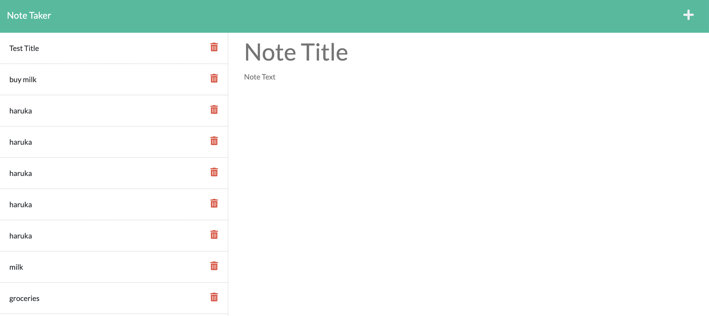

# Note Taker Starter Code
Creates reminder notes

## Links to the webpage and repository

To access the website use [Reminder Note](https://reminder-note-haruka08.herokuapp.com/notes)

To access the GitHub repository use [GitHub Repository Profile Generator](https://github.com/Haruka08/reminder_note)

## Content

The website consists of following 3 sections:

1. Navigation pane
    1. Return to start page
    2. Save new note button
    3. Create new note button

2. New note entry
    1. Note title
    2. Note description

3. List of saved notes

## Screenshot of the modified website

